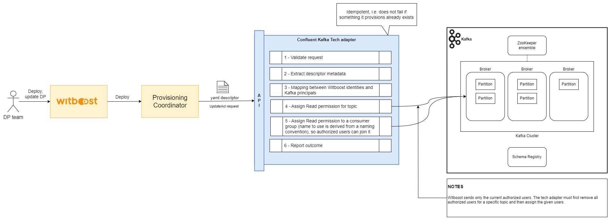

# High Level Design

This document describes the High Level Design of the Confluent Kafka Tech Adapter.
The source diagrams can be found and edited in the [accompanying draw.io file](HLD.drawio).

- [Overview](#overview)
- [Provisioning](#provisioning)
- [Unprovisioning](#unprovisioning)
- [Update ACL](#update-acl) 

## Overview

### Tech Adapter

A Tech Adapter (TA) is a service in charge of performing a resource allocation task, usually
through a Cloud Provider. The resources to allocate are typically referred to as the _Component_, the
details of which are described in a YAML file, known as _Component Descriptor_.

The TA is invoked by an upstream service of the Witboost platform, namely the Coordinator, which is in charge of orchestrating the creation
of a complex infrastructure by coordinating several TAs in a single workflow. The TA receives
the _Data Product Descriptor_ as input with all the components (because it might need more context) plus the id of the component to provision, named _componentIdToProvision_

To enable the above orchestration a TA exposes an API made up of five main operations:
- validate: checks if the provided component descriptor is valid and reports any errors
- provision: allocates resources based on the previously validated descriptor; clients either receive an immediate response (synchronous) or a token to monitor the provisioning process (asynchronous)
- status: for asynchronous provisioning, provides the current status of a provisioning request using the provided token
- unprovision: destroys the resources previously allocated.
- updateacl: grants access to a specific component/resource to a list of users/groups

### What is Apache Kafka?

Apache Kafka is an open-source distributed streaming system used for stream processing, real-time data pipelines, and data integration at scale. Originally created to handle real-time data feeds at LinkedIn in 2011, Kafka quickly evolved from a messaging queue to a full-fledged event streaming platform, capable of handling over one million messages per second, or trillions of messages per day.

Founded by the original creators of Apache Kafka, Confluent provides the most comprehensive Kafka tutorials, training, services, and support. Confluent also offers fully managed, cloud-native data streaming services built for any cloud environment, ensuring scalability and reliability for modern data infrastructure needs.

#### Core Components and concepts of Kafka Architecture

- **Kafka Cluster**: A Kafka cluster is a distributed system composed of multiple Kafka brokers working together to handle the storage and processing of real-time streaming data. It provides fault tolerance, scalability, and high availability for efficient data streaming and messaging in large-scale applications.
- **Brokers**: Brokers are the servers that form the Kafka cluster. Each broker is responsible for receiving, storing, and serving data. They handle the read and write operations from producers and consumers. Brokers also manage the replication of data to ensure fault tolerance.
- **Topics and Partitions**: Data in Kafka is organized into topics, which are logical channels to which producers send data and from which consumers read data. Each topic is divided into partitions, which are the basic unit of parallelism in Kafka. Partitions allow Kafka to scale horizontally by distributing data across multiple brokers.
- **Producers**: Producers are client applications that publish (write) data to Kafka topics. They send records to the appropriate topic and partition based on the partitioning strategy, which can be key-based or round-robin.
- **Consumers**: Consumers are client applications that subscribe to Kafka topics and process the data. They read records from the topics and can be part of a consumer group, which allows for load balancing and fault tolerance. Each consumer in a group reads data from a unique set of partitions.
- **ZooKeeper**: ZooKeeper is a centralized service for maintaining configuration information, naming, providing distributed synchronization, and providing group services. In Kafka, ZooKeeper is used to manage and coordinate the Kafka brokers.
- **Offsets** : Offsets are unique identifiers assigned to each message in a partition. Consumers will use these offsets to track their progress in consuming messages from a topic.
- **Schema Registry**: Stores and manages schemas for Kafka messages (commonly in Avro, Protobuf, or JSON formats). Ensures schema compatibility to prevent breaking changes in data processing.

#### ACL concepts
Access control lists (ACLs) provide important authorization controls for Apache Kafka cluster data.

##### Authorizer
An authorizer is a server plugin used by Apache Kafka to authorize operations. More specifically, an authorizer controls whether to authorize an operation based on the principal and the resource being accessed. The default Kafka authorizer implementation, for ZooKeeper-based clusters, is `AclAuthorizer` (kafka.security.authorizer.AclAuthorizer).

##### Principal
A principal is an entity that can be authenticated by the authorizer. Clients of a Confluent Server broker identify themselves as a particular principal using various security protocols. The way a principal is identified depends upon which security protocol it uses to connect to the Confluent Server broker (for example: mTLS, SASL/GSSAPI, or SASL/PLAIN). Authentication depends on the security protocol in place (such as SASL or TLS) to recognize a principal within a Confluent Server broker.

The `AclAuthorizer` only supports individual users and always interprets the principal as the user name. However, other authorizers support groups. Therefore, when specifying the principal, you must include the type using the prefix `User:` or `Group:` (case-sensitive). Here are some examples: `User:admin`, `Group:developers`, or `User:CN=quickstart.confluent.io,OU=TEST,O=Sales,L=PaloAlto,ST=Ca,C=US`.

### Confluent Kafka Tech Adapter

The **Confluent Kafka Tech Adapter** provides integration with Kafka to manage topics (along with schemas) and apply ACLs to them. It uses the [Admin Client API](https://docs.confluent.io/kafka/kafka-apis.html#admin-api).

It offers:
- **Topic Management**: Create Topics allowing to define standard and advanced options.
- **Topic Schema Management**: Register a schema for a topic to the Schema Registry
- **Topic ACL Management**: Assign configurable permissions on a topic to the Owner and Read permission for whoever request access to it. The implementation expect the usage of `AclAuthorizer` authorizer with the `SASL/PLAIN` authentication. A user is expected to be defined with the same name as in Witboost. It's possible to support additional principals types like TLS certificates and Kerberos implementing a specific mapping for them.

## Provisioning

## Unprovisioning

## Update ACL

